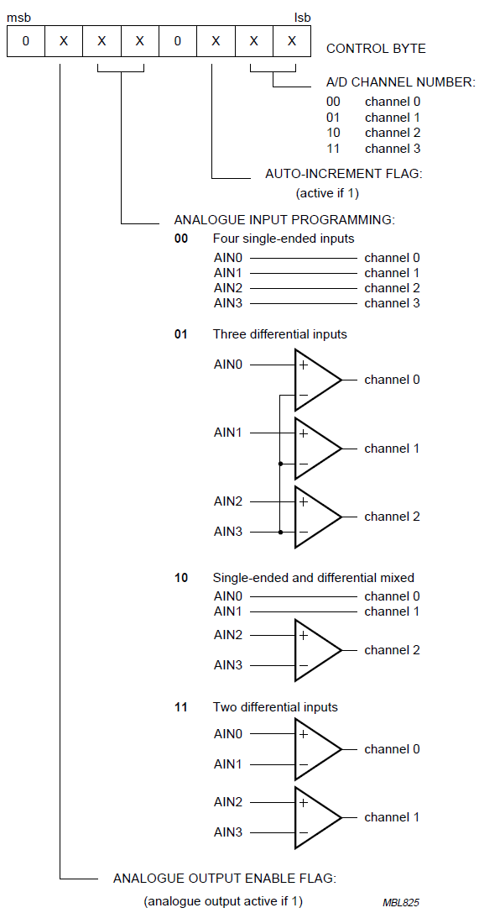

# Datasheet analyse pcf8591

[Marius Versteegen, 2025]

## De pcf8591 in kaart brengen

De datasheet van de pcf8591 moet het uitgangspunt zijn voor onze code, dus die downloaden we. Vervolgens zoeken we gericht antwoord op de volgende vragen:

- **Op welke voedingspanningen** kan het werken?

- **Hoeveel stroom** verbruikt het?

- **Welke databussen** ondersteunt het?

- **Welke functionaliteiten** heeft het?

Na het bovenstaande overzicht kunnen we dan een keuze maken voor de databus die we willen gaan gebruiken, en een nieuwe vragenlijst voor onszelf opstellen, met de vraag hoe de betreffende databus werkt op de chip, en hoe we elk van de functionaliteiten kunnen gebruiken.

### Op welke voedingsspanningen kan het werken?

- Op pg16: **supply voltage VDD kan tussen 2.5V en 6V**
  We kunnen het dus op dezelfde spanning als onze Arduino Uno gebruiken (5V) en de in- en output pinnen zonder levelshifters met elkaar verbinden.

- Op pg 16: Het **maximale stroomverbruik IDD is 1mA**. Dat is ruimschoots onder de halve ampere die de usb-voeding van onze laptop aankan. Er is dus geen reden om een externe lab-voeding te gebruiken voor het voeden van de chip.

- Ik zie in de datasheet maar 1 busprotocol terug (op pg14), en dat is het **I2C** protocol.

- Een overzicht van de **belangrijkste functionaliteiten** vind ik in de "Features list" op pg 3:
  
  - Je kunt het **I2C adres aanpassen met pinnen**.
  - Er zijn **4 analoge (ADC) inputs** die je kunt **instellen om apart te werken of in groepjes van twee** (als differentiele inputs).
  - Er is "**auto incremented channel selection**" mogelijk, voor efficient ophalen van data uit meerdere inputs.
  - Er is ook een **DAC** (met analoge output).

### De I2C databus

Er is maar 1 databus om uit te kiezen, dus die keus is makkelijk gemaakt.
De volgende vraag is hoe die werkt op deze chip. 

- Standaard I2c of nog **bijzonderheden**?

- Wat is het **i2c adres** van de chip?

#### Standaard I2c

Het blijkt te gaan (zie pg12) om het standaard I2c protocol. Het maakt gebruik van de **SCL** pin (dat is pin 10, zie de pin-layout op pg 4) en de **SDA** pin (pin 9). Zoals gewoonlijk bij I2c kunnen we die pinnen met outputpinnen van onze microcontroller verbinden. Die outputpinnen moeten dan in "**open collector**" mode geconfigureerd zijn (anders werkt het "waslijn idee" niet). Verder moeten die pinnen volgens pg 12 ook nog via een **pullup weerstand** met de voedingsspanning verbonden worden (om de waslijn hoog te houden als niemand hem naar beneden trekt). Enfin, volgens mij kunnen output pinnen van de Arduino Uno als open collector mét (ingebouwde) pullup-weerstand geconfigureerd worden, en heeft het **YL-40 boardje** waar onze chip op zit ook al pullup-weerstanden op die lijnen zitten, dus dat moet goedkomen.

#### Het I2C adres van de chip

Dit wordt uitgelegd op pg 5. Het 7-bits I2C adres bestaat uit de bits 1001, gevolgd door 3 bits, welke te kiezen zijn door het aansluiten van de **pinnen A2, A1 en A0** op de voeding of op ground. Op het YL-40 boardje zijn die pinnen met ground verbonden. Op dat boardje heeft de chip dus zijn **"basisadres"** 0b1001000, ofwel **0x48**.
Maar we moeten er in onze library dus rekening mee houden dat het anders kan zijn, en dat er dus een getal van 0 tm 7 bij opgeteld zou kunnen worden.

## Hoe de functionaliteiten te gebruiken

Nu willen we nog weten hoe elk van de eerder gevonden functionaliteiten gebruikt kan worden. De eerste daarvan, het aanpassen van het I2C adres hebben we voorgaand al besproken.

### De analoge inputs instellen

Het instellen van wat de chip moet gaan doen, gebeurt door het updaten van het control register, welke uit 1 byte bestaat (zie pg 5, alinea 7.2). Een overzicht van waar de bits van dat register voor dienen, is afgebeeld in Figuur 5 op pg 6. Onderstaand heb ik die gekopieerd:

- Het eerste bit is **ongebruikt**. 

- Via het tweede bit kan de **DAC output** aangezet worden. Verderop gaan we bekijken hoe dat verder in zijn werk gaat.

- De 2 bits erna bepaalt de **mapping van de gelezen inputs naar de waarden die we kunnen uitlezen (de channels)**.
  
  - **00** is **rechttoe-rechtaan**: Analoge input 1 mapt op op channel 1, die van 2 op 2 etc.
  - **01** mapt op channel 0 het verschil tussen AIN0 en AIN3,
    op channel 1 het verschil tussen AIN1 en AIN3,
    en op channel 2 het verschil tussen AIN2 en AIN3.
    Dus eigenlijk fungeert de spanning op **AIN3 dan als een soort referentiespanning (zelfgekozen ground)** ten opzichte waarvan je de spanningen op AIN0 tm AIN2 wilt meten.
  - **10** mapt AIN0 en AIN1 rechttoe rechtaan op channel 0 en 1,
    terwijl het verschil tussen AIN2 en AIN3 op channel 2 wordt gemapt.
  - **11** mapt het verschil tussen AIN0 en AIN1 op channel 0 en het verschil tussen AIN2 en AIN3 op channel 1

- Dan nog een **ongebruikte bit**.

- Dan de **AUTO-increment flag**. Verderop gaan we die verder bekijken.

- Dan 2 bits om het **AD channel te kiezen** waar je waarden uit wilt lezen.

Okee, tot dusver het control byte. De volgende vragen komen nu op:

- **Hoe** kunnen we de channels uitlezen?

- **Hoe snel** kunnen we de channels uitlezen?

### Hoe kunnen we channels uitlezen?

Stel, we hebben het control byte ingesteld, hoe kunnen we dan die channels uitlezen? In het control byte zelf kunnen we, zoals we zagen met 2 bits al een channel kiezen, door de juiste waarde naar het control register te schrijven.

#### Eerst instellen

Om iets in I2c te schrijven, moeten we **eerst het adresbyte versturen** (zodat de chip weet dat er tegen hem gepraat wordt), waarbij het onderste bit (het read-<u>write</u> bit ) op 0 staat (dus op **schrijven**). Enfin, dat kunnen we binnen het Arduino IDE platform doen met de Wire library. Die zet zelf bij een write dat onderste bit op 0 (komt verderop).
Vervolgens dus dat **control register byte** op de bus **schrijven**.

#### Dan lezen

De chip is dan goed ingesteld. Vervolgens kunnen we gaan lezen door weer een **adresbyte** te versturen, maar dit keer met het read-<u>write</u> bit op 1 (betekent dat je wilt gaan **lezen**).

Vervolgens kun je bytes gaan lezen. Dat staat uitgelegd op pg 9 van de datasheet:

- Het **eerste byte** dat je leest is "een **vorige sample**" van het geselecteerde channel.

- De bytes die **volgen**, zijn steeds de **meest recente** channel waarden.
  Je kunt die stream blijven uitlezen zo lang je wilt (zie fig 17 op pg 14).

#### Auto-increment flag

Dat wordt iets anders als je de auto-increment flag in het control-byte ook geset hebt. In dat geval is elk **volgende byte van het volgende van de channels** (zie opmerking op pg 5, alinea 7.2). Dat gaat cyclisch. De tweede byte is altijd channel 0 (ongeacht het kanaal van de allereerste "vorige" byte, zie pg..). Na channel 3 is channel 0 weer aan de beurt, enzovoort. Zo kun je dus maximaal snel de bytes van de channels streamen.

### Hoe snel kunnen we de channels uitlezen?

- De snelheid van de **I2C bus** is **100kHz** (fscl = 100Khz, zie blz 19).

- Dus als je gestreamd bytes leest (1 byte duurt 8 bits + een acknowledge bit, dus eigenlijk 9 klokcyli), dan kom je dus uit op maximaal 100kHz / 9 = **11.1 kHz** aan bytes, tenminste, als de chip ook zo snel die bytes kan AD-converteren als dat de I2C bus ze kan versturen.

- Dat blijkt inderdaad het geval: de chip heeft namelijk ook een conversion rate van 11.1kHz (zie **fdac** op blz 17).

- Eigenlijk werd daar ook al naar gehint in de features op pg 3. Daar staat immers "sampling rate given by I2C bus speed".

### Encoding van de gelezen bytes

Iets wat ik tegenkwam tijdens het lezen van de datasheet, is dat encoding van de bits in de gelezen bytes met channel waardes afhangt van wat het channel representeert (zie Pg 10): 

- Als de **channel** ingesteld staat op een **verschilwaarde**, dan is het byte een **2's complement** getal, en representeert het getallen tussen -128 en +127.

- Als de channel ingesteld staat op een **enkele input**, dan is een een reguliere unsigned byte, met waarden **tussen de 0 en de 255**.

Dus vooral die eerste is goed om te beseffen.

### Hoe werkt de DAC?

De laatste functionaliteit die we nog niet hebben bestudeerd, is die van de DAC, de digitaal naar analoog conversie. Als de **analogue output enable flag** gezet wordt, dan wordt de analoge output aangezet (zie pg 5). **Als je naar de pcf8591 schrijft**, dus eerst adresbyte en controlbyte zoals hierboven aangegeven, en je vervolgens nieuwe **bytes blijft schrijven**, dan zijn die nieuwe bytes de waarden die je naar analoog wilt converteren en op de AOUT uitgangspin (zie pg 8 ). Die waarden zijn dan genormaliseerd tussen de spanningen op pin AGND (de liefst schone, analoge ground) en de pin REF (met de liefst schone referentiespanning). Bijvoorbeeld een waarde van 255 resulteert dus in een spanning op AOUT die gelijk is aan de spanning op REF.

### Reference voltage

Iets anders wat ik tegenkwam, is dat je op een pin (vref) een **referentiespanning** kunt zetten. Dat bepaalt dan het bovenbereik van de AD-conversie. Stel bijvoorbeeld dat vref = 1V. Dan levert het meten van een spanning op AIN0 van 1V of hoger de waarde 255 op. 

Dat is bijvoorbeeld handig als je er een oscilloscoop mee wilt maken. Voor het meten van kleine spanningen gebruik je dan een **lage referentiespanning**, zodat je die **kleine spanningen precieser kunt meten**.

Verder is het handige van die aparte pin met referentiespanning, dat je daar een spanning neer kunt zetten die **schoner** is dan de voedingsspanning (bijvoorbeeld dankzij een **R-C filter**), waardoor je nauwkeuriger metingen kunt doen.
