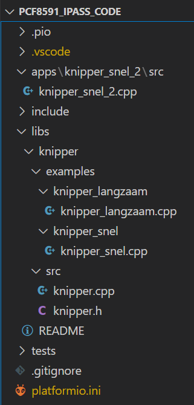
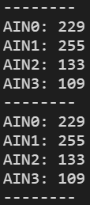

# Logboek library en applicatie voor pcf8591

[Marius Versteegen, 2025]

## Inleiding

Ik ben gevraagd een voorbeeld te maken voor de library+applicatie opdracht. Daar hoort het bijhouden van een logboek bij. Dat is dit logboek. Ik kreeg de vraag een beetje last minute. Effectief heb ik er slechts 1 werkdag de tijd voor. Vandaar dat ik kies voor een veilige approach. Ik kies ervoor de library Arduino IDE compatibel te maken. Als microcontroller voor het testen kies ik de Arduino Uno, omdat de studenten die ook hebben. Verder houd ik omwille van de tijd de applicatie eenvoudig.

Dit markdown document zelf maakt niet gebruik van pagina nummers. Als er een verwijzing nodig is, wordt een hyperlink gebruikt. Los genoemde paginanummers verwijzen naar paginas van de datasheet van de pcf8591.

## Chip keuze: de pcf8591

Als uitgangspunt neem ik de pcf8591 chip, omdat we (plenair) de datasheet ervan al hebben doorgenomen (om dezelfde redenen kan deze chip niet meer door een student gekozen worden voor deze opdracht). De chip kan **AD en DA conversies** uitvoeren, in allerlei configuraties. We willen dat onze library zoveel mogelijk van de op de chip beschikbare functionaliteiten op een gebruiksvriendelijke manier ontsluit. 

## Applicatie

Als **"fallback" applicatie** kies ik voor het gebruik van het kant-en klare **YL-40** boardje: dus het uitlezen van temperatuur, potmeterstand en licht.

Ideëen voor andere leuke applicaties waar ik vermoedelijk niet de tijd voor zal hebben binnen deze werkdag zijn:

- Een **memorecorder** ervan maken: Als ik de record knop ingedrukt houd, wordt van de microfoon geluid opgenomen. Als ik vervolgens op play druk, wordt het weer afgespeeld. 
  Uiteraard kan het nog veel geavanceerder, met het opslaan naar files, een hele UI erbij etc.

- Het spel **Pong** ermee maken: elke speler heeft een potmeter als "paddle", en bestuurt daarmee zijn staaf. Kan op oled schermpje weergegeven worden, of misschien zelfs in serial monitor?

Zo'n leuke applicatie gebruikt meestal niet alle functionaliteiten van de chip, en is vaak ook niet de meest tijd-efficiente manier om die te testen.

Daarom wil je daarnaast wil je altijd "**unit tests**", waarmee je snel de verschillende functionaliteiten van je library kunt testen. 

## De pcf8591 in kaart brengen

Het uitgangspunt van de library is de datasheet van de pcf8591. Dus het is een goed idee om die zo goed mogelijk in kaart te brengen. Terwijl ik dat doe, noteer ik dat in het document [datasheet_analyse_pcf8591](./datasheet_analyse_pcf8591.md).

## Hello World

Om te weten of je een en ander goed begrepen hebt, is het handig om zo snel mogelijk een soort "Hello World" moment voor de chip te proberen te maken: **een kleine test waarbij je succesvol met de chip communiceert**. Mocht dat na enkele dagen nog steeds niet lukken, dan is het een goed idee om terug te vallen op een **fallback plan**. Bijvoorbeeld het schrijven van een library voor een kleurensensor chip.

### Arduino IDE?

Met de Arduino IDE is iedereen al bekend, dus het lijkt voor de hand liggend om de code daar in te bouwen. Echter, het blijkt dat je dan 2 keuzen hebt: 

- Of al je code, inclusief je library-klassen in **één folder** (wat lelijk en onoverzichtelijk is)

- Of je **library** in het **algemene** bij Arduino IDE bekende libraries path plaatsen. (en **elke ino** met applicatie of test in **aparte folders** met gelijke naam). Voor elke library en app zou je dan weer een **aparte repo** kunnen maken.
  Dat is voor nu te onhandig. Het lijkt me juist handig is dat je in je git een enkele folder hebt met je project, inclusief apps, tests, libraries.

### Platform.io!

Enfin, om deze reden ben ik maar uitgeweken naar Platform.io. Dat is ook Arduino-IDE compatible qua code, maar laat **flexibelere organisatie van je bestanden** toe.

Enfin, om dat te testen heb ik als "hello world" een knipper (licht) klasse gemaakt, en een folder-structuur gedefinieerd, en het bouwen ervan getest in VSCode met Platformio plugin.

De folder structuur ziet er als volgt uit:



Kortom:

- Een **apps** folder voor al onze applicaties

- een **tests** folder voor al onze (integratie-) tests

- een **libs** folder voor onze libraries

- een **include** folder voor globale includes voor alle apps in ons project
  (houd die zo leeg mogelijk :-) )

In bovenstaande voorbeeld is er: 

- een "knipper library", met daarin een knipper klasse en twee examples die toepassing ervan demonstreren: "knipper_snel" en "knipper_langzaam".

- een "knipper_snel_2" app, die ook die knipper klasse gebruikt.

NB: als **foldernaam** gebruikte ik de **specifieke naam** "pcf8591_ipass_code" ipv "code",
omdat ik van plan ben om die folder een repo te laten zijn. Het is dan wel handig als hij een herkenbare, specifieke naam heeft.

Het was een gedoe-tje, maar het lukte uiteindelijk om zowel de examples als de app te bouwen, na uitvogelen van de volgende platformio.ini file in de project folder:

```ini
; PlatformIO Project Configuration File
;
;   Build options: build flags, source filter
;   Upload options: custom upload port, speed and extra flags
;   Library options: dependencies, extra library storages
;   Advanced options: extra scripting
;
; Please visit documentation for the other options and examples
; https://docs.platformio.org/page/projectconf.html

; [door Marius Versteegen, 2025]

; Onderstaand blok geldt voor het hele project
[env]
platform = atmelavr
board = uno
framework = arduino
; origineel gebruikt platformio lib, maar ik vind libs logischer.
lib_extra_dirs   =
    lib
    libs

; vaste poort bij upload en Serial Monitor
upload_port  = COM22 
monitor_port = COM22
monitor_speed = 9600

; eventuele externe libs in de Arduino IDE libraries folder 
; (dacht ik, nog niet getest)         .
;lib_deps = 
;    budryerson/TFLI2C@^0.2.0
;    adafruit/Adafruit PWM Servo Driver Library@^2.4.0

; origineel gebruikt platformio een main.cpp in de main src dir,
; maar ik vind het fijner om aparte folders te hebben voor de 
; apps en tests.

[env:knipper_snel_2]
src_filter = +<../apps/knipper_snel_2/src/knipper_snel_2.cpp>

[env:knipper_snel]
src_filter = +<../libs/knipper/examples/knipper_snel/knipper_snel.cpp>

[env:knipper_langzaam]
src_filter = +<../libs/knipper/examples/knipper_langzaam/knipper_langzaam.cpp>

; selecteer bijvoorbeeld als volgt wat je wilt bouwen en uploaden:
; pio run -e knipper_snel -t upload
```

**Als je .vscode folder nog leeg is**:

- start VSCode

- klik op de "**alien**" symbol in de linker zijbalk (start platformio) 

- selecteer: "**Pick folder** met existing platformio.ini"

- **dan genereert platformio de files**:
  c_cpp_properties.json, extensions.json en launch.json in je .vscode folder.

Je kunt vervolgens bouwen door op "**new platformio terminal**" te klikken:


En vervolgens bijvoorbeeld in te typen:
**pio run -e knipper_snel -t upload**

Dat bouwt en upload in dit geval de knipper_snel example van de knipper library.

Tsja.. dit was eigenlijk mijn Hello World voor PlatformIO.
Waar ik eigenlijk heen wilde, is de Hello World voor de chip.

## Hello World voor PCF8591

Op basis van de bestudering van de datasheet maak ik een hello world, waarmee ik de 4 analoge inputs uitlees en weergeef:

```cpp
#include "Arduino.h"
#include <Wire.h>

// We willen geen magic constants, dus definiëren we alle constants hier.
const uint8_t   PCF8591_address = 0x48;
const int       serialBaudRate  = 9600;
const int       maxNofChannels  = 4; // A0 is de enige analoge pin op de Arduino Uno

void setup() 
{
  Serial.begin(serialBaudRate);
  Wire.begin();
}

void loop() 
{
  for (int i = 0; i < maxNofChannels; i++) {
    // Kies single-ended input mode en een channel
    // door de juiste bits in het control register te schrijven.
    Wire.beginTransmission(PCF8591_address);
    // De laagste 2 bits selecteren de channel.
    // De overige bits staan op 0. Dat betekent:
    // - De DAC output is uitgeschakeld.
    // - Analoge inputs 0..3 worden 1 op 1 op channel 0..3 gemapt.
    // - De autoincrement flag is uitgeschakeld.
    Wire.write(0x00 | i);
    Wire.endTransmission();

    // Lees 2 bytes: de eerste is de "vorige waarde" van de ADC.
    // De tweede is de waarde die we willen hebben.

    // Lees 2 bytes van de PCF8591 in de cache.
    Wire.requestFrom(PCF8591_address, 2);

    // Lees de eerste byte uit de cache.
    Wire.read();
    // Lees de tweede byte uit de cache.
    int value = Wire.read();

    // Print de waarde naar de serial monitor
    Serial.print("AIN");
    Serial.print(i);
    Serial.print(": ");
    Serial.println(value);
    if((i%4)==3) Serial.println("--------");
  }

  // Wacht even, anders komt er meer data naar de serial monitor dan die
  // kan verwerken. (bovendien vliegt het dan te snel voorbij om te kunnen lezen)
  delay(2000);
}
```

Dat lijkt te werken, ik krijg in de serial monitor waardes te zien die veranderen als ik bijvoorbeeld de hoeveelheid licht verander of aan een potmeter draai op het YL-40 boardje:



Dat is fijn. De hello world voor de PCF8591 is dus een succes. Ik hoef niet terug te vallen op een eenvoudiger chip - pfew! :-)

## Ontwerp fase

We willen graag de volgende dingen ontwerpen:

- Een library met een **klasse voor specifiek de pcf8591**, welke zoveel mogelijk van de unieke functionaliteit van die chip makkelijk toegankelijk maakt.

- Meer **generieke interfaces**, van welke de pcf8591 afgeleid kan worden. Door dat te doen, kan eventueel in de toekomst de pcf8591 worden vervangen door een of meerdere andere chips, zonder een regel code te hoeven veranderen in de applicaties die ervan afhankelijk zijn. Om die te bedenken is een onderzoek nodig naar vergelijkbare chips en dan te kijken welke functies overeenkomen.

- **Tests** voor de functies. Liefst ook zoveel mogelijk op basis van generieke interfaces, zodat ook de tests herbruikbaar zijn.

- Een "leuke" **applicatie** waar het wordt toegepast. Misschien kom ik nog toe aan een pong-prototype :-).

### Library klasse voor de pcf8591

Ik zet nog even de functionaliteiten kort op een rijtje die we tijdens het lezen van de datasheet zijn tegengekomen en we graag makkelijk willen kunnen gebruiken:

- **I2C adres** meegeven

- Analoge inputs **mappen op de channels**.

- Een **channel (voor het eerst) uitlezen**.

- Alle channels **(cyclisch) herhaald uitlezen** .

- De **DAC aanzetten of uitzetten**.

- Een **waarde schrijven naar de DAC**.

Nadat een control-byte geschreven is, en je leest een channel, dan krijg je eerst de vorige waarde en daarna de meest recente. Ik zie het voordeel van die vorige waarde niet zo, dus ik ben van plan die te skippen, zoals in het hello world voorbeeld.

#### I2C adres meegeven

Met de pinnen A0..A2 kan het I2C adres aangepast worden. Om daar rekening mee te houden ben ik van plan die bij de constructor mee te geven. Voorbeeld van initialisatie:

- PCF8591 pcf8591(0x48);

#### Analoge inputs mappen op de channels

Dat gebeurt met 2 bits, bit 5 en 6. Het lijkt me aardig om voor die twee bits een enum te maken, met duidelijke namen voor elk van de 4 mappings:

```cpp
    // Bits 4 en 5 van het control byte bepalen de mapping van de analoge inputs
    // naar de kanalen.
    enum AinToChannelMappingMask : uint8_t
    {
        // Elke Analoge input wordt 1 op 1 gemapt naar een kanaal:
        AIN_N_TO_CHANNEL_N = 0b00<<4,

        // De mate waarin AIN0, AIN1 en AIN2 groter zijn dan AIN3 
        // wordt gemapt naar kanaal 0, 1 en 2:
        AIN0_1_2_MINUS_AIN3_TO_CHANNEL_0_1_2 = 0b01<<4,

        // Analoge inputs 0 en 1 worden 1 op 1 gemapt naar kanaal 0 en 1:
        AIN0_1_TO_CHANNEL_0_1__AIN2_MINUS_AIN3_TO_CHANNEL_2 = 0b10<<4,

        // Het verschil tussen AIN0 en AIN1 en het verschil tussen AIN2 en AIN3
        // wordt gemapt naar kanaal 0 en 1:
        AIN1_MINUS_AIN0_TO_CHANNEL_0__AIN2_MINUS_AIN3__TO_CHANNEL_1 = 0b11<<4
    };
```

#### Channels voor het eerst uitlezen

Dat kan met readChannel(channel), lijkt me. Bijvoorbeeld:

- value = readChannel(0);

#### Channels (cyclisch) herhaald uitlezen

De channels kunnen ook herhaald uitgelezen worden. Er is geen nieuwe schrijven van het control byte nodig als de vorige actie dezelfde read was. Alleen de eerste keer moet het eerste (vorige) byte gediscard worden.

In de datasheet staat dat (na het retourneren van de vorige waarde) de cyclische reads altijd beginnen bij channel 0. Aardig lijkt me: readCyclical(channelidThatWasRead). De eerste keer leest die er 2 en discard er één. De reference parameter retourneert het id van de uitgelezen channel.

Voorbeeld:

- value = readCyclical(channelThatWasRead); // waarbij channelThatWasRead een reference parameter is. (zodat het een waarde kan teruggeven)

#### DAC aan of uitzetten

.. door het betreffende bit van het control byte aan te passen.
.. bij nader inzien: je kunt de DAC ook automatisch aanzetten als je erheen schrijft, en alleen desgewenst weer expliciet uitzetten (om evt energie te besparen).

#### Waarde schrijven naar de DAC

- als de vorige operatie geen DAC-schrijf operatie was: door een schrijfoperatie te starten, het control byte te schrijven en de dac waarde te schrijven

- als de vorige operatie wel een DAC-schrijf operatie was, dan zijn we nog steeds in de DAC-bytes schrijfmodus, en kunnen we direct een byte bijschrijven.

### Coderen

Okee, de plannen zijn gemaakt. Eens kijken of een en ander te coderen is.

## Op zoek naar generieke interfaces

Het zou mooi zijn als we onze chip toegankelijk zouden kunnen maken via generieke interfaces, zodat de chip makkelijk vervangen kan worden door een andere chip zonder dat afhankelijke applicaties daarvoor hun code hoeven te veranderen.

Om die generieke interfaces te bedenken, onderzoeken we welke andere ADC en/of DAC chips er op de markt zijn, en zoeken we naar de overeenkomsten.

### Andere I2C chips met ADC en/of DAC

Dit is een greep uit de andere ADC en/of DAC I2C chips op de markt:

- TI ADS1015 en TI ADS1115
  - 4 kanaals ADC
- Microchip MCP3421
  - 1 kanaals ADC
- Microchip MCP3421
  - 2 kanaals ADC
- Microchip MCP4725
  - 1 DAC
- Microchip MCP4728
  - 4 kanaals DAC
- Analog Devices LTC2615 en LTC2604
  - 4 kanaals DAC
- MCP30016
  - 16 kanaals ADC
- MAX5821
  - 8 kanaals ADC

#### Ontdekte overeenkomsten:

- De optie om te **streamen** (dat wordt ook wel "continuous mode" vs "single shot" genoemd (zoals op [datasheet ads1115](https://www.ti.com/lit/ds/symlink/ads1115.pdf), pg 12).
- Er kunnen **meerdere kanalen** zijn, tot wel **16**.
- De optie om te **cycelen** door die kanalen (zoals op [datasheet MCP4728](https://ww1.microchip.com/downloads/en/DeviceDoc/22187E.pdf) pg38).
- De maximaal voorkomende **resolutie** is **16 bit**.
- Het komt ook vaker voor dat **ADC input-paartjes differentieel** kunnen worden uitgelezen (zoals eveneens de ads1115). Typisch AIN0 met AIN1, AIN2 met AIN3 etc.
  Bij differentiele outputs is het datatype **2-complements integer**.

### Ontwerp van de library

Rekeninghoudend met bovenstaande kom ik op het volgende ontwerp:


**NB:** In het ontwerp zijn **alleen** de **publieke** interface functies weergegeven. Dus niets private's. Bij hoog niveau ontwerpen ben je meestal niet geinteresseerd in (veel) private members.

- De **PCF8591** ontsluit zo gebruiksvriendelijk mogelijk **alle specifieke** functies van de chip. Via de AinToChannelMapping enum kan bijvoorbeeld een specifieke input configuratie gekozen worden. Als streaming aangezet wordt, wordt de I2C transactie niet afgesloten. Dat betekent wel dat de I2C-bus dan bezet blijft. De I2C-bus kan dan weer worden vrijgegeven door expliciet "endStreaming()" aan te roepen. readCyclical activeert impliciet ook streaming.
- Voor elk van de hoofdfunctionaliteiten is er een **abstracte interface**, welke de meest voorkomende mogelijkheden ontsluiten die ook op veel soortgelijke chips voorkomen: 
  - **IDAC** voor de **DAC aansturingen**. De PCF8591 heeft maar 1 DAC. Andere chips kunnen er meerdere hebben. Met getNofDacs() is "the Number Of" Dacs op te vragen.
  - **IADC** voor het uitlezen van de "**analoge input pins**" via AD-conversie. Met getNofADCs() is het aantal dat er is op te vragen.
  - **IADCdiff** voor het uitlezen van de **verschilspanningen** tussen paarsgewijze analoge input pins. Dus de spanning tussen AIN0 en AIN1, die tussen AIN2 en AIN3, etc, afhankelijk van hoeveel paartjes er zijn. Het aantal paartjes kan opgevraagd worden met getNofADCdiffs().
- Voor elk **apart**, want niet in elke applicatie heb je alle 3 de hoofdfunctionaliteiten nodig. Je zou de chip dan ook kunnen vervangen door een andere chip die ook alleen biedt wat je nodig hebt. Of, als je alles nodig hebt, door meerdere chips die elk van die functionaliteiten bieden.
- Voor compatibiliteit wordt rekening gehouden met tot **16 bit** nauwkeurigheid.
  Stel dat de resolutie van een chip bijvoorbeeld slechts 10 bit is, dan worden zijn getallen 6 bits naar links verschoven (de 6 least significant bits zijn dan altijd 0).
- De klasse **GenericPCF8591** is een **wrapper/adapter** klasse van de **PCF8591**. In zijn implementatie worden aanroepen van publieke interfaces vertaald naar de specifieke calls van de PCF8591. NB: stel dat je ooit bijvoorbeeld de PCF8591 in je applicatie wilt **vervangen** door de ADS1115, dan kun je bijvoorbeeld een bestaande ADS1115 library nemen (of er een schrijven), en die wrappen in de klasse "GenericADS1115", welke dan ook afleidt van IADC en IADCdiff. De **code** van je applicatie kan dan **ongewijzigd** blijven.

```cpp
/**********************************************************************/
// Voorbeeld van applicatie met PCF8591, welke IADC en IDAC gebruikt:
/**********************************************************************/
GenericPCF8591 genericPCF8591;
IDAC& dacChip(genericPCF8591);
IADC& adcChip(genericPCF8591);

//.. gebruik de dacChip en adcChip in je applicatie, bijvoorbeeld:
int16_t adcValue = adcChip.readADC(/*adcIndex*/ 0, /*streaming*/ false);
dacChip.writeDAC(/*dacIndex*/ 0, adcValue, /*bStreaming*/ false);

/**********************************************************************/
// Als de PCF8591 is uitverkocht, of je wilt om andere redenen andere
// chips gebruiken:
/**********************************************************************/
GenericLTC2604 genericLTC2604;
GenericADS1115 genericADS1115;
IDAC& dacChip(genericLTC2604);
IADC& adcChip(genericADS1115);

//.. Je applicatie kan dan hetzelfde blijven:
int16_t adcValue = adcChip.readADC(/*adcIndex*/ 0, /*streaming*/ false);
dacChip.writeDAC(/*dacIndex*/ 0, adcValue, /*bStreaming*/ false);
```

### Mogelijke verbeteringen

Mogelijke verbeteringen van de library (welke het wel weer complexer en iets trager maken..):

- **Ook de Wire en SoftWire libs** van arduino **wrappen**, zodat:
  
  - Je library werkt **met elk van beide**, zonder daar code voor te hoeven aanpassen.
  - Je **foutmeldingen** kunt inbouwen als er een nieuwe I2C transactie gestart wordt terwijl er nog eentje open staat (doordat vergeten is endStream() aan te roepen). 

**Voordelen:**

- Je ziet **niet langer** aan één I2C bus vast.
- Het wordt makkelijker om **foutief busgebruik** **op te sporen**.

## Implementatie

Hoe nu die klassen te coderen? Dat kun je doen via de volgende stappen:

- Maak voor elke functionaliteit een "hello world", zoals hierboven.

- Als dat eenmaal werkt, de code stapsgewijs refactoren, zodat het in de ontworpen structuur komt.

Dat is vooral een ambacht dat je leert door het te doen, door veel meters te maken achter je toetsenbord.
